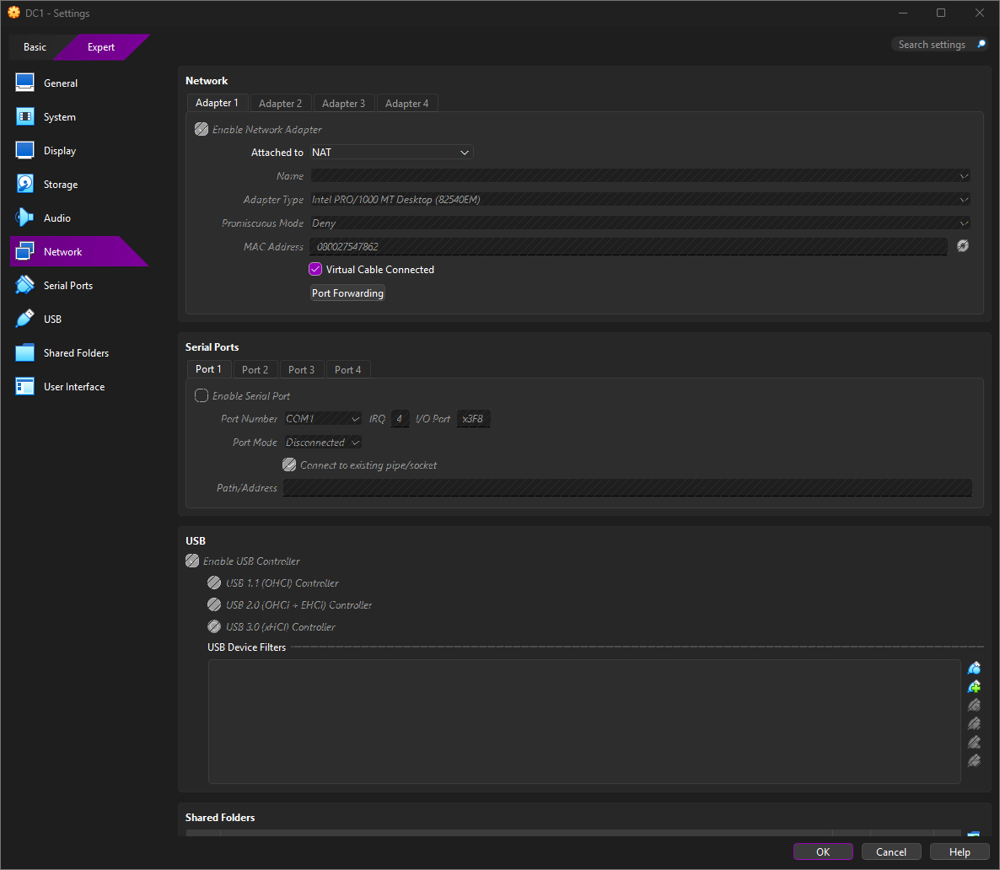
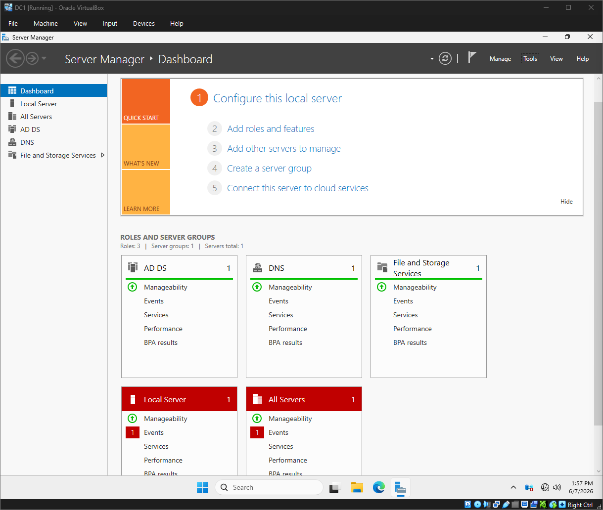
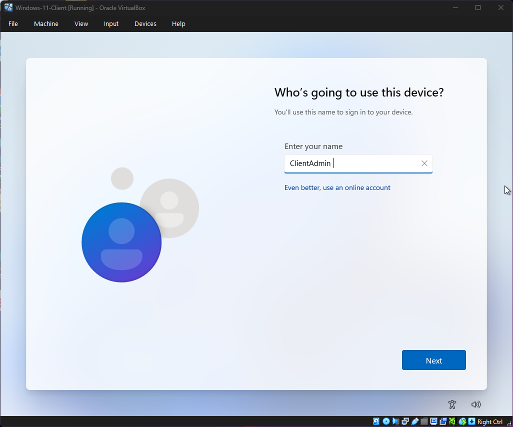

# Enterprise Infrastructure Sandbox: Active Directory & Endpoint Deployment

## Project Overview
This project details the end-to-end engineering, provisioning, and integration of a secure, isolated enterprise network infrastructure. Using Oracle VirtualBox, a primary Windows Server Domain Controller was deployed alongside a Windows 11 Enterprise client node. The environment was engineered using a strictly non-routable internal network topology to eliminate external attack vectors and simulate a secure corporate sandbox.

## Architectural Highlights (Recruiter Summary)
* **Network Isolation Layer:** Configured an isolated internal network switch (`intnet`) to enforce strict local routing boundaries, demonstrating a production-grade mindset toward sandbox security.
* **Identity & Access Management (IAM):** Provisioned a localized Active Directory forest (`mydomain.local`) utilizing proper static IPv4 schemas and integrated DNS zone hierarchies.
* **System Optimization & Troubleshooting:** Resolved interface routing loops caused by legacy NAT bindings and programmatically adjusted host firewalls to allow deterministic enterprise traffic.

---

## Technical Deployment Log

### Phase 1: Domain Controller Provisioning & Core Networking
The initial phase focused on deploying the foundational infrastructure host, establishing static addressing bounds, and configuring core Active Directory roles.

* **Step 1: Base Virtual Appliance Network Configuration**
  
  > **Technical Context:** Initialized the virtualization layer network parameters for the primary host node, binding interface controls to structural baseline segments.

* **Step 2: Active Directory Domain Services (AD DS) Initialization**
  
  > **Technical Context:** Successfully provisioned the AD DS and DNS roles via Server Manager, preparing the server for local forest promotion.

---

### Phase 2: Client Virtual Appliance Layer Staging
This phase documents the provisioning of the secondary Windows 11 workstation, configuring virtual storage allocations, and setting up the guest OS environment.

* **Step 3: Virtual Disk and Hardware Allocation**
  
  > **Technical Context:** Allocated storage blocks and virtual disk layouts (`.vdi`) within the hypervisor layer to sustain the client node profile.

* **Step 4: Hypervisor Interface Hardening**
  
  > **Technical Context:** Configured physical-to-virtual network interface card (NIC) bindings on the workstation, transitioning infrastructure components away from default dynamic pools.

* **Step 5: Storage Volumetrics & Target Drive Partitioning**
  
  > **Technical Context:** Structured unallocated storage blocks during the Windows 11 installation sequence to establish localized root system directories.

* **Step 6: Local Security Account Manager (SAM) Initial Provisioning**
  
  > **Technical Context:** Provisioned the foundational local administrative account profile (`ClientAdmin`) during the operating system Out-Of-Box Experience (OOBE).

* **Step 7: Hypervisor Guest Addition Subsystem Deployment**
  
  > **Technical Context:** Mounted and compiled guest virtualization subsystem drivers to enable dynamic hardware rendering and cross-boundary kernel utilities.

---

### Phase 3: Infrastructure Alignment & Network Optimization
This phase focuses on standardizing host configurations, modifying IP allocation layers, and resolving critical network routing anomalies across the internal switch.

* **Step 8: Hostname Standardization**
  
  > **Technical Context:** Enforced systematic naming conventions by changing the client machine's generic computer name to a structured asset tracking ID (`W11-CLIENT-01`).

* **Step 9: Static IPv4 Schema & DNS Pointer Mapping**
  
  > **Technical Context:** Configured static IPv4 addressing (`172.16.0.100/24`) on the workstation, setting the primary DNS pointer directly to the Domain Controller interface (`172.16.0.10`).

* **Step 10: Connectivity Verification & Inter-VM Routing Fix**
  
  > **Technical Context:** Successfully resolved routing conflicts by disconnecting legacy NAT adapters, resulting in full Layer 3 connectivity across the `intnet` vSwitch with 0% packet loss.

---

### Phase 4: Active Directory Forest Integration
The final phase details the cryptographic domain-join sequence, administrative verification, and profile container synchronization on the target network.

* **Step 11: Domain Directory Authentication Challenge**
  
  > **Technical Context:** Triggered the interactive domain-join challenge, successfully prompting the client machine to locate the `mydomain.local` directory zone via authoritative DNS lookups.

* **Step 12: Successful Domain Admission**
  
  > **Technical Context:** Successfully authenticated administrative credentials, generating an active object reference in the domain controller database and admitting the client machine to the forest.

* **Step 13: Centralized Identity Session Initiation**
  
  > **Technical Context:** Initiated the profile compilation phase, logging into the workstation using the enterprise domain account (`MYDOMAIN\Administrator`).

* **Step 14: Cryptographic Token & Environment Verification**
  
  > **Technical Context:** Executed environmental diagnostics (`whoami`), verifying that the system successfully recognizes the local token under the primary domain administrative security descriptor.
