# Windows Server Active Directory & Client Lab

## Project Overview
This project shows how to build a basic corporate IT lab environment using VirtualBox. I set up a Windows Server Domain Controller to manage a Windows 11 client computer over a private, isolated internal virtual network.

## What I Learned
* **Active Directory:** Setting up a domain forest (`mydomain.local`) and managing user logins.
* **Networking Basics:** Configuring static IP addresses, setting up DNS routing, and testing connectivity.
* **System Administration:** Changing computer names to match company standards and joining client machines to a corporate domain.

---

## 📜 Step-by-Step Lab Log

### Phase 1: Virtual Network & Server Verification

#### Step 1: Checking the Virtual Network Configuration
Opening the network settings in VirtualBox for the Domain Controller (`DC1`) to make sure the network adapter is configured properly.

#### Step 2: Verifying Active Directory Installation
Checking the Windows Server Manager dashboard to confirm that Active Directory (AD DS) and DNS server roles are installed and running.

---

### Phase 2: Setting Up the Windows 11 Client Machine

#### Step 3: Creating the Virtual Hard Drive
Going through the VirtualBox wizard to create a new 50 GB virtual hard drive for the Windows 11 client machine.
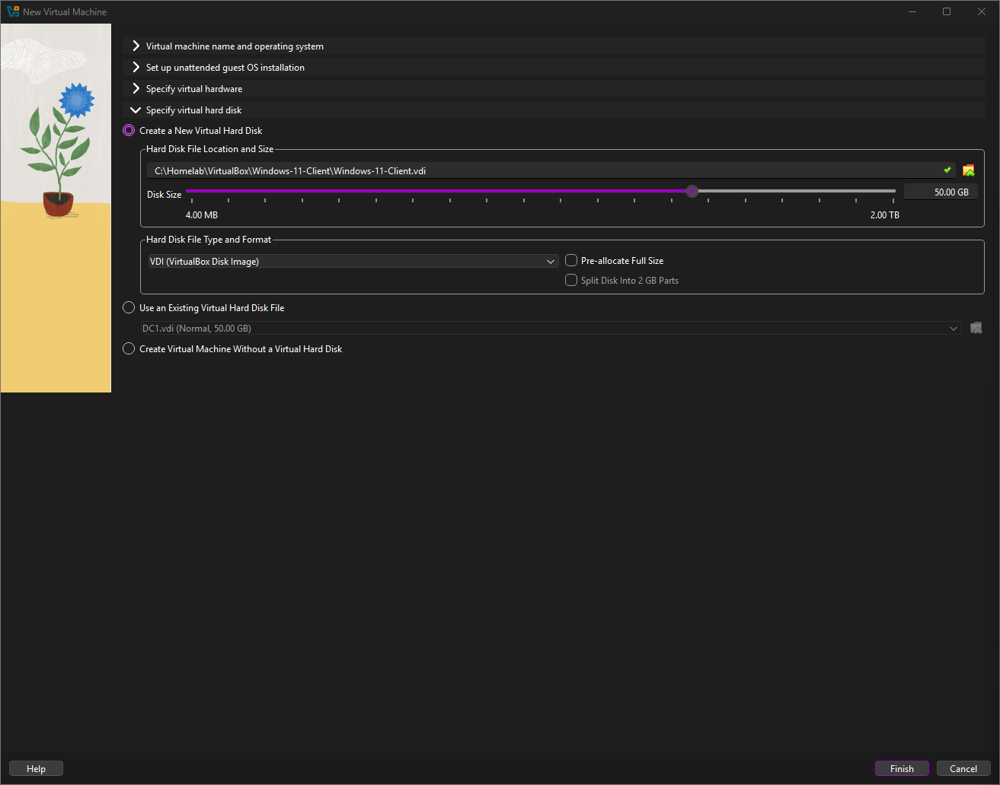

#### Step 4: Setting Up Client Network Access
Connecting the Windows 11 virtual machine to the internet temporarily via NAT to get the initial system configuration ready.
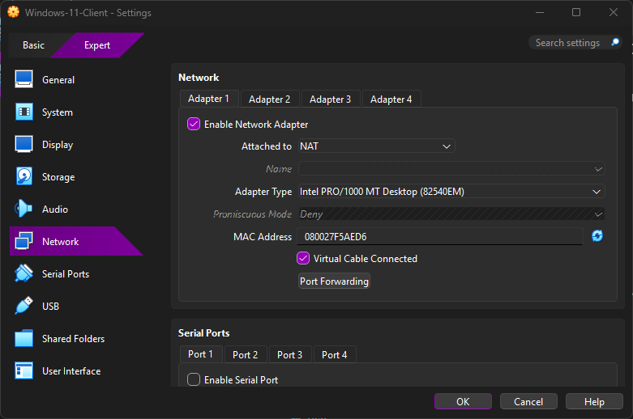

#### Step 5: Choosing the Installation Drive
Booting into the Windows 11 setup installer and selecting the blank virtual hard drive to begin installing the operating system.
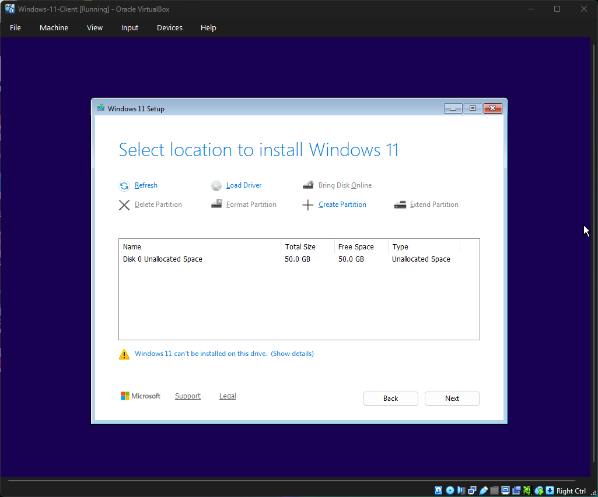

#### Step 6: Creating the Local Admin Account
Setting up the initial local administrator account profile with the username `ClientAdmin` during the Windows 11 setup screen.

#### Step 7: Installing VirtualBox Guest Additions
Installing the Guest Additions tool inside the booted Windows 11 desktop so features like full-screen mode and smooth mouse movement work correctly.
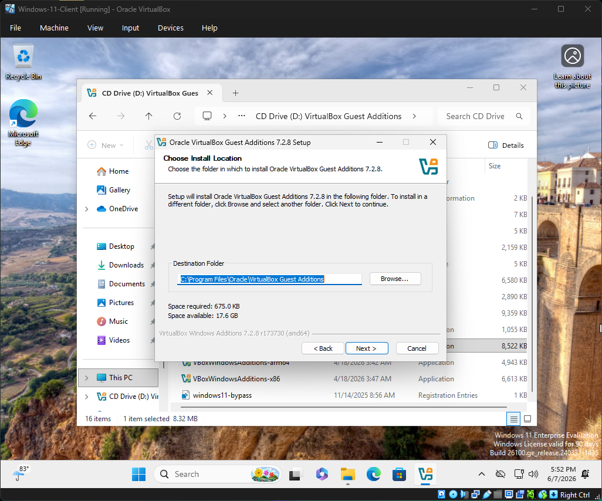

---

### Phase 3: Network Setup & Testing

#### Step 8: Renaming the Computer
Changing the computer's name from the random default Windows name to a standard company format: `W11-CLIENT-01`.
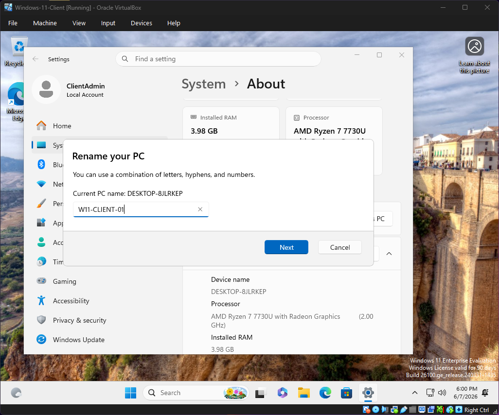

#### Step 9: Configuring Static IP and DNS
Manually entering a static IP address (`172.16.0.100`) on the client machine and pointing the DNS server to the Domain Controller's IP address so they can talk to each other.
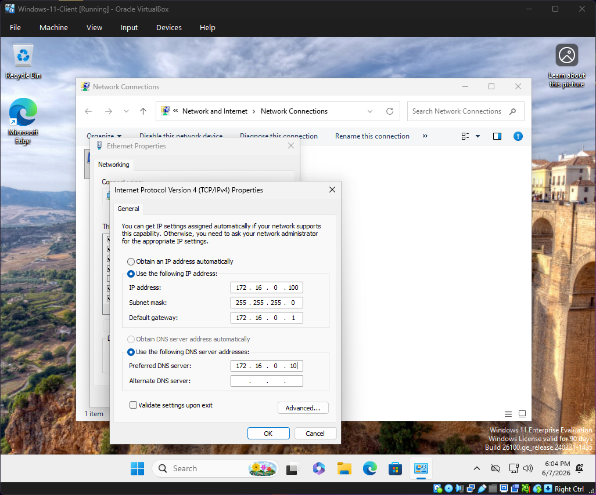

#### Step 10: Testing the Network Connection
Opening the Command Prompt and using the `ping` command to test the connection between the client machine and the server, confirming 0% packet loss.
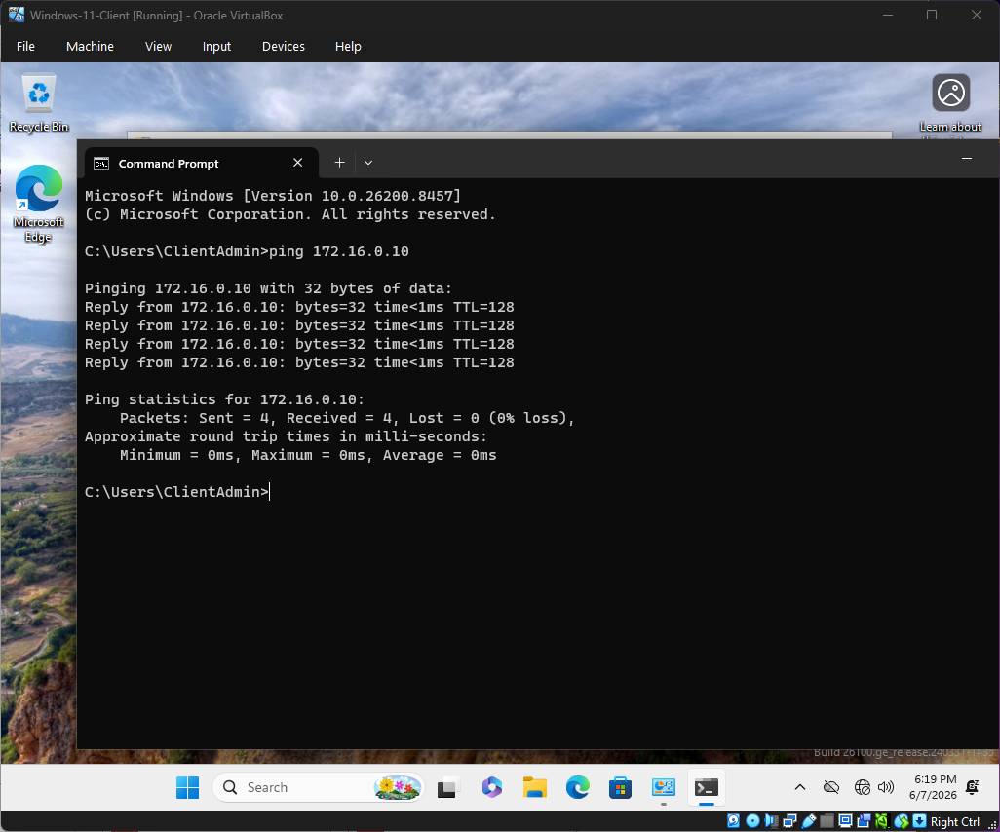

---

### Phase 4: Joining the Active Directory Domain

#### Step 11: Entering Domain Credentials
Opening the system properties on the Windows 11 machine, typing in the domain name `mydomain.local`, and entering the administrator password to request access.
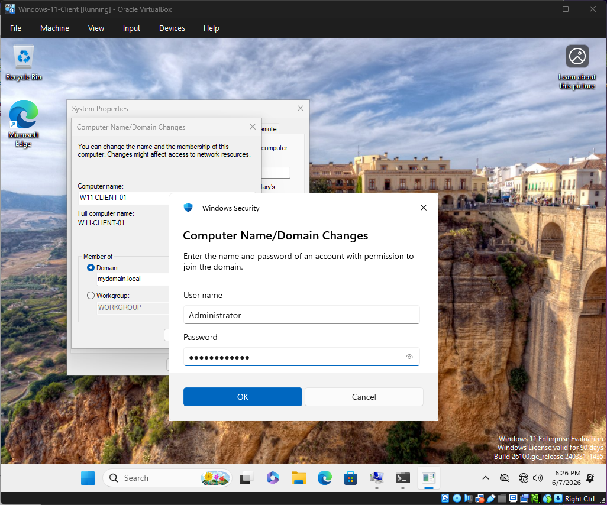

#### Step 12: Successful Domain Join
Receiving the official welcome message box confirming that the Windows 11 client has successfully joined the `mydomain.local` domain.
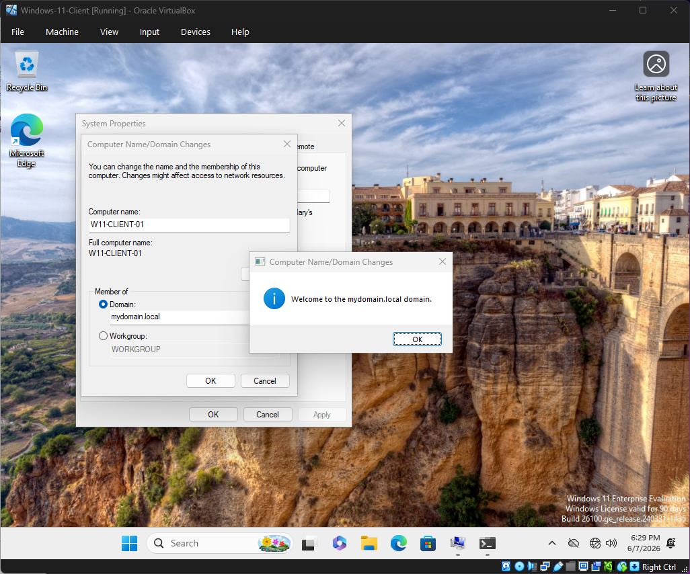

#### Step 13: Booting into the Local Desktop
Restarting the machine and loading into the clean local desktop workspace environment to verify everything boots up normally.
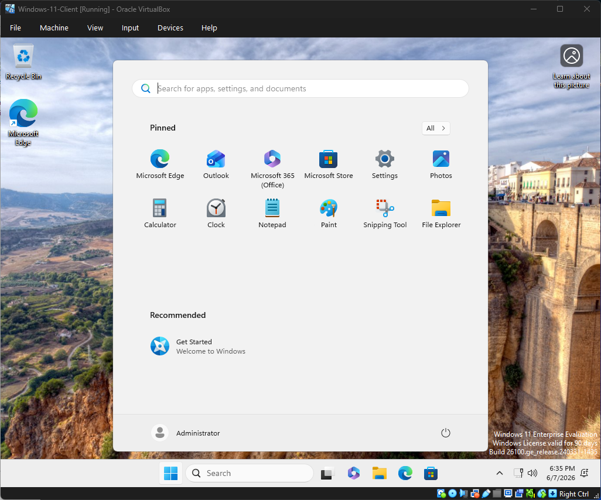

#### Step 14: Verifying the Active User Login
Opening the Command Prompt and running the `whoami` command to prove that the machine officially recognizes the current logged-in account as part of the domain environment (`mydomain\administrator`).
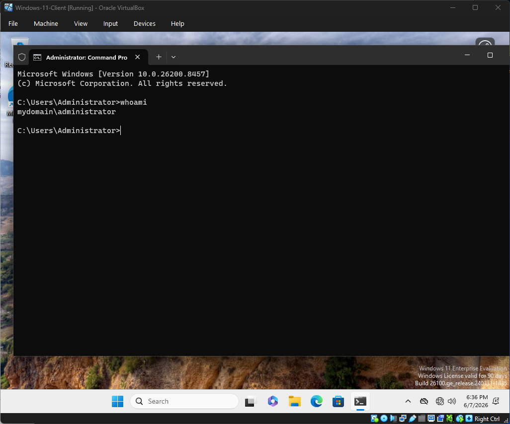
